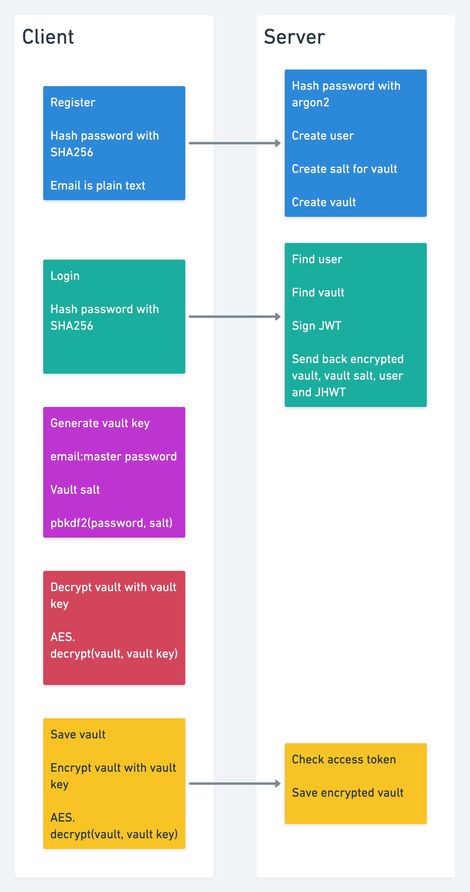

# Password manager

## What will you learn?
* Various hashing and encryption strategies
* How password managers work
* Basic React.js
* Basic TypeScript

## Algorithms used
* SHA256 - Predictable password hash
* Argon2 - Unpredictable password hash for the database
* pbkdf2 - Generate the vault key
* AES256 - Encrypt and decrypt the vault

## Data flow

